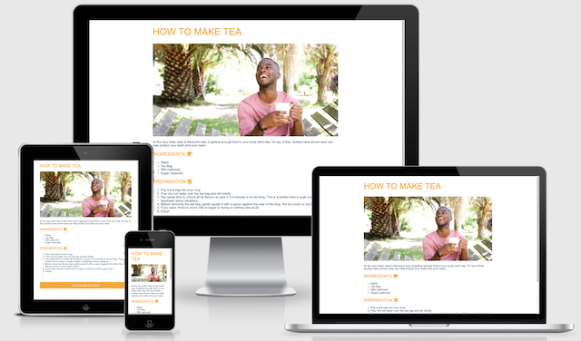

# Code Institute - 5 Day Coding Challenge solution

This is a solution to the [5 Day Coding Challenge](https://codeinstitute.net/5-day-coding-challenge/) from the Code Institute. It is basically a challenge where you can learn the basics of coding with a free introductory course. Each day, for 5 days, you are given a new coding challenge to complete with tutorial videos and detailed notes. This was the first website I ever coded from scratch.

## Overview

### The challenge

- Build a tea recipe website with responsiveness and minimal interactivity.

### Screenshots

- [Mobile](images/mobile-image.png)
- [Desktop](images/desktop-image.png)

### Links

- [Repo](https://github.com/Franciskadtt/Tea-Recipe-Steps)
- [Live site](https://franciskadtt.github.io/Tea-Recipe-Steps/)

## My process

### Built with

- HMTL
- CSS 
- Javascript

### What I learned
- This was the first website I ever coded from scratch. Before this project, I only ever worked with WordPress (the no-code version)
- I was introduced to HTML, CSS and a basic intro to Javascript

## Author

- Website - [Franciska Du Toit](https://franciskadutoit.com/)
- Instagram - [@designed.byfranciska
](https://www.instagram.com/designed.byfranciska/)
- LinkedIn - [@franciskadutoit
](https://www.linkedin.com/in/franciskadutoit/)

## Acknowledgements

- All content and images were provided by [Code Institute
](https://codeinstitute.net/)
